

  <h1>
    Doctor Appointment App
  </h1>
  <h3>A Modern Healthcare Platform for Seamless Doctor-Patient Interactions</h3>

## 📸 Banner

    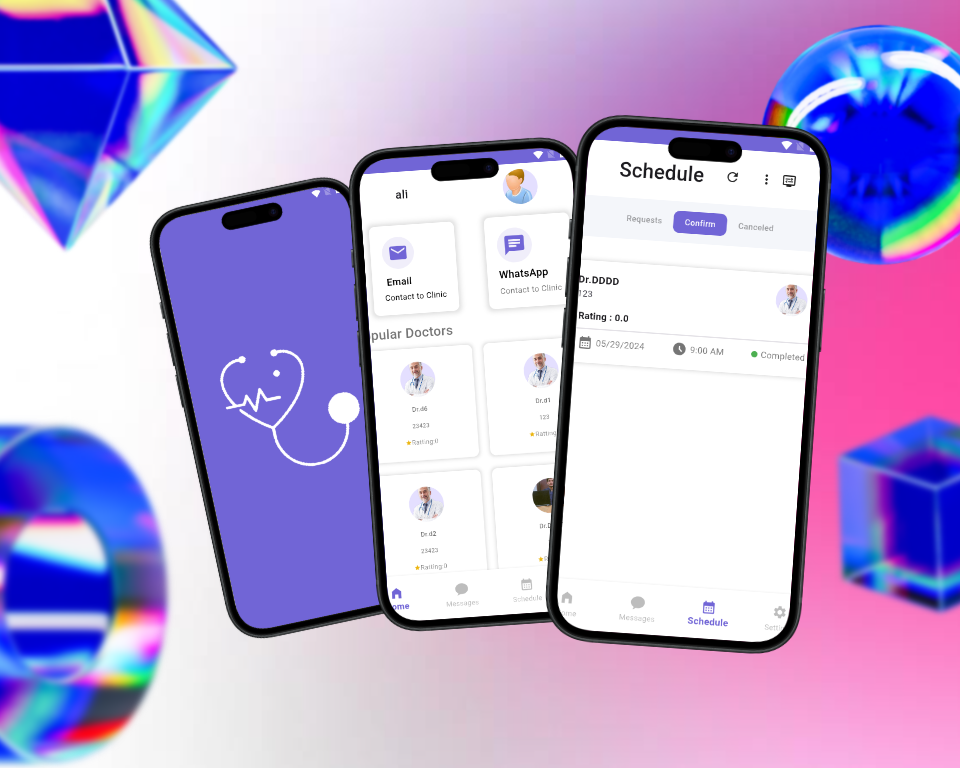

    
    
    

## 📸 Screenshots

### Welcome & Authentication

<table border="1">
  <tr>
    <td align="center">
      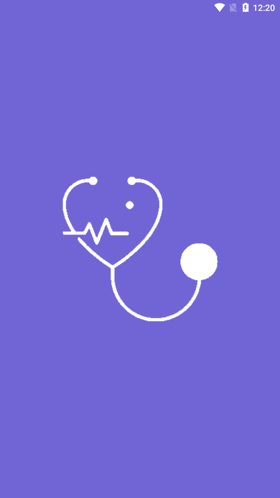
      
<b>Splash Screen</b>

    </td>
    <td align="center">
      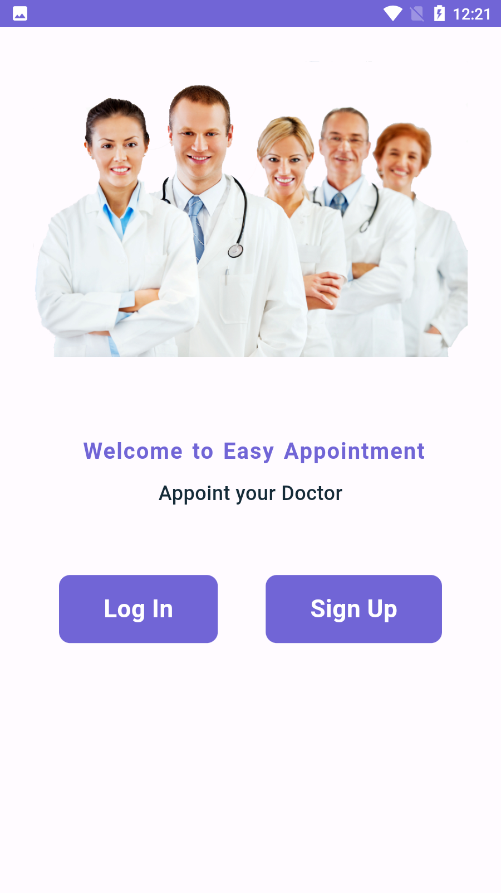
      
<b>Welcome Screen</b>

    </td>
  </tr>
</table>

### Patient Features

<table border="1">
  <tr>
    <td align="center">
      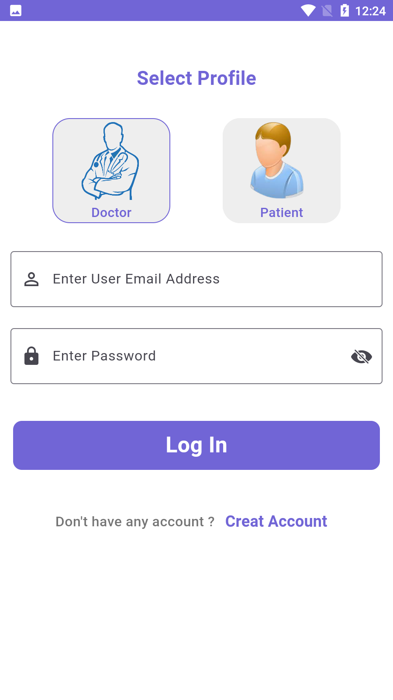
      
<b>Patient Login</b>

    </td>
    <td align="center">
      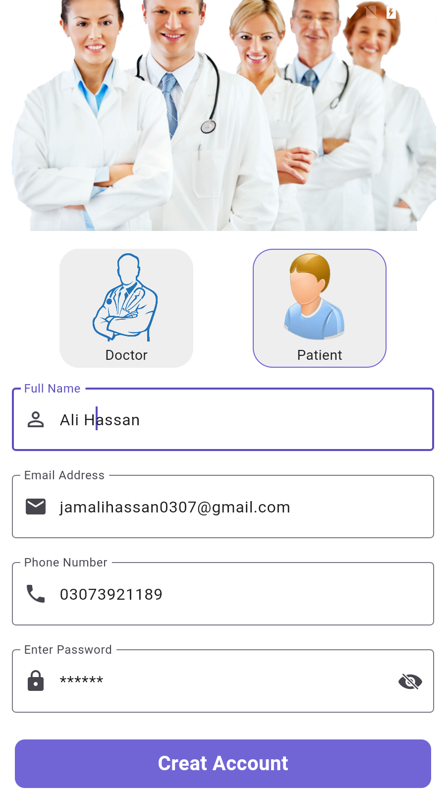
      
<b>Patient Signup</b>

    </td>
    <td align="center">
      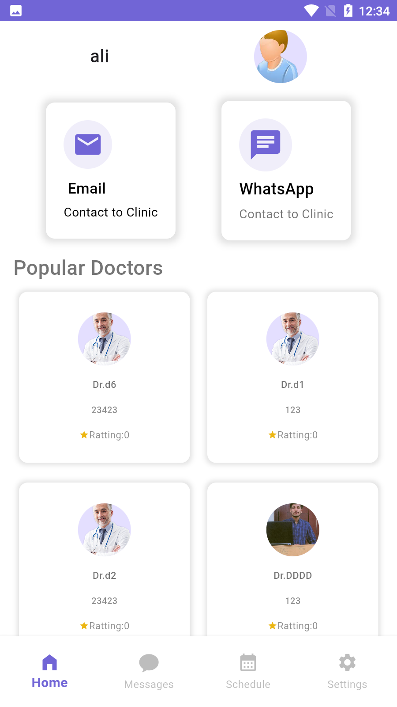
      
<b>Patient Home</b>

    </td>
  </tr>
  <tr>
    <td align="center">
      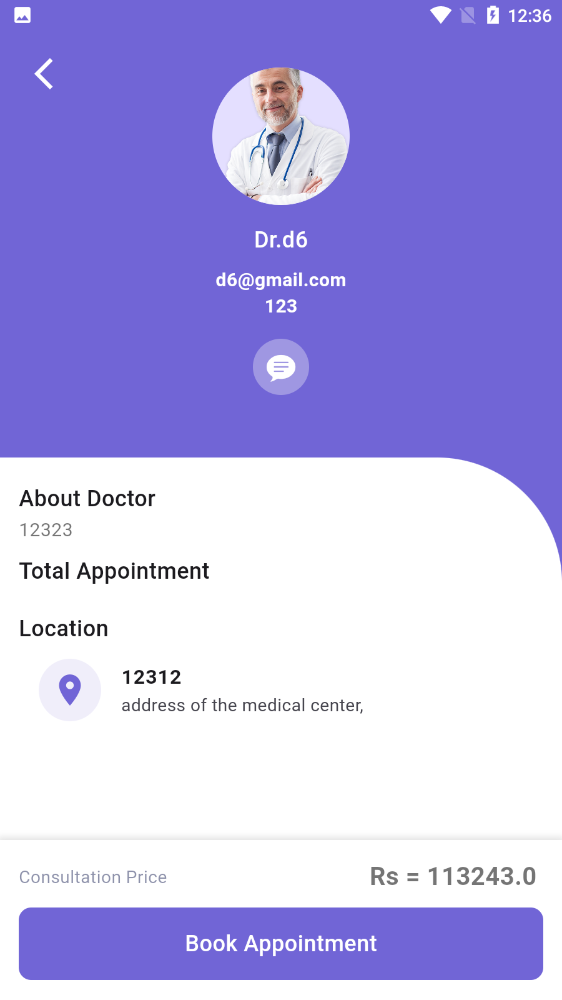
      
<b>Doctor Details</b>

    </td>
    <td align="center">
      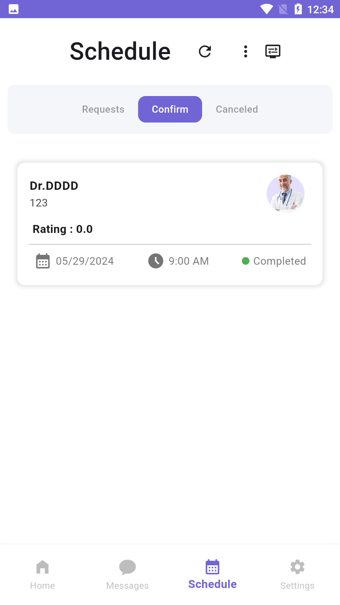
      
<b>Appointments</b>

    </td>
    <td align="center">
      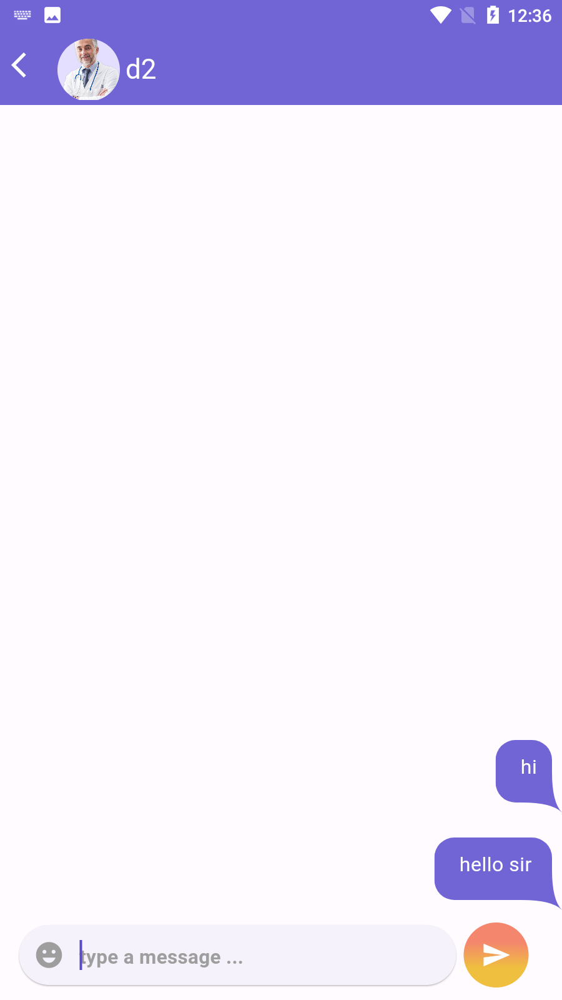
      
<b>Chat</b>

    </td>
  </tr>
</table>

### Doctor Features

<table border="1">
  <tr>
    <td align="center">
      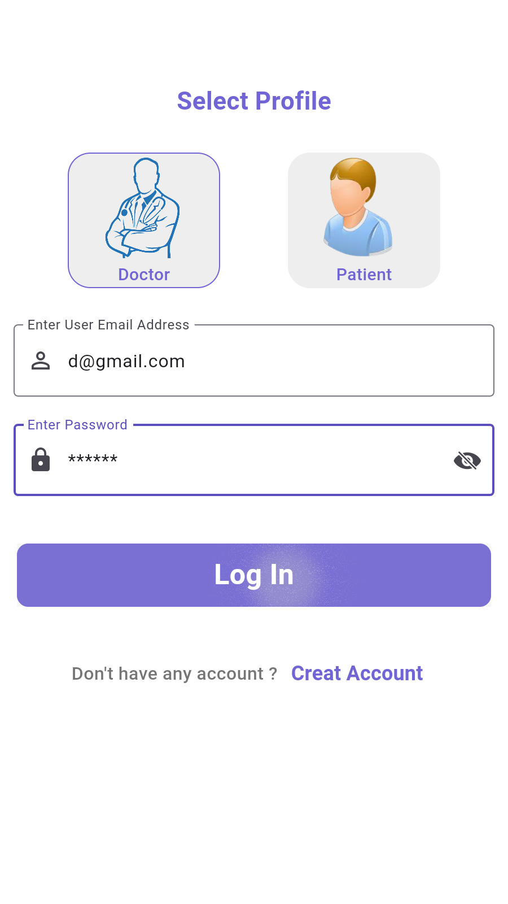
      
<b>Doctor Login</b>

    </td>
    <td align="center">
      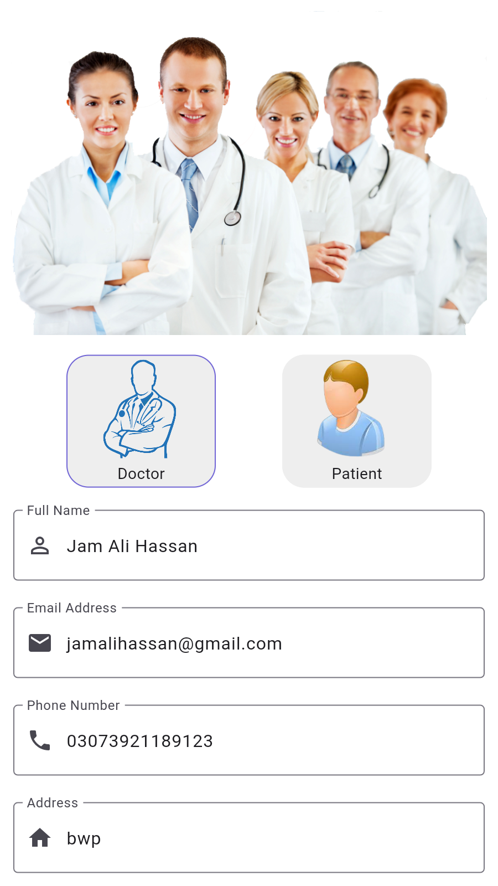
      
<b>Doctor Signup</b>

    </td>
    <td align="center">
      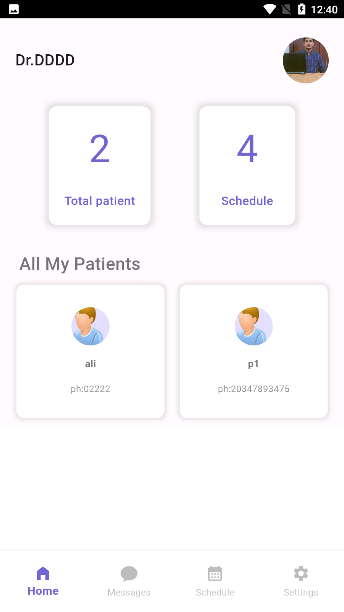
      
<b>Doctor Home</b>

    </td>
  </tr>
  <tr>
    <td align="center">
      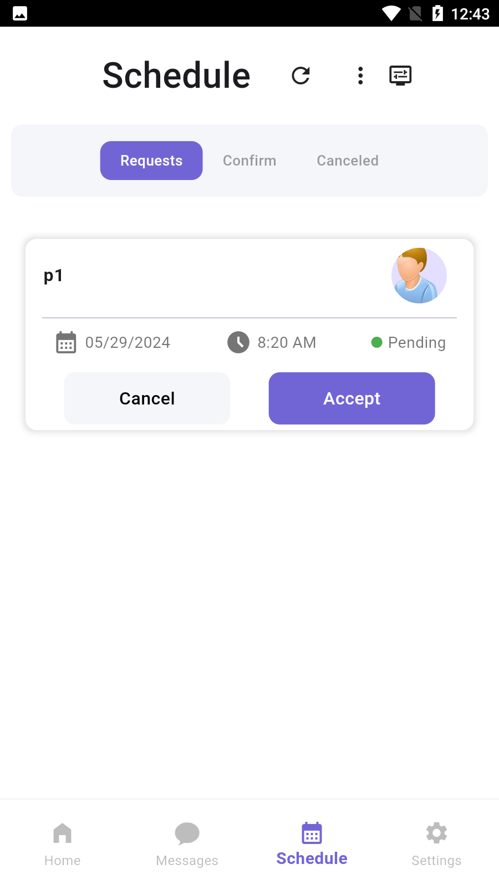
      
<b>Appointment Management</b>

    </td>
    <td align="center">
      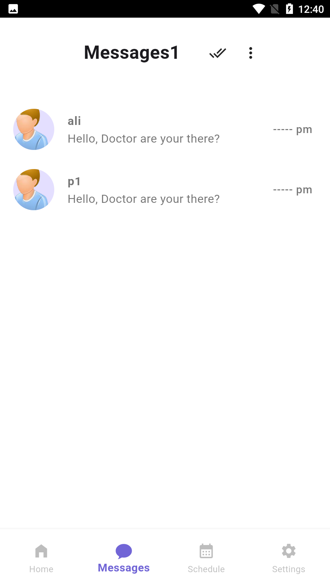
      
<b>Inbox</b>

    </td>
    <td align="center">
      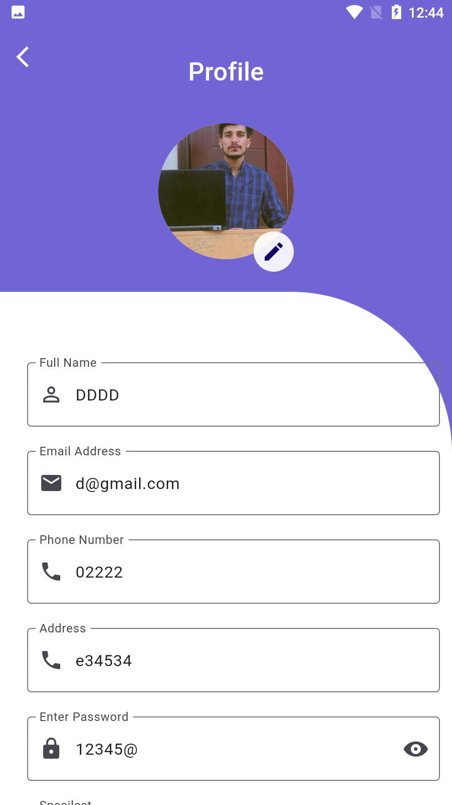
      
<b>Profile Update</b>

    </td>
  </tr>
</table>

## 📱 Features

### For Patients
- **Easy Appointment Booking**: Schedule appointments with preferred doctors
- **Doctor Search**: Find and filter doctors based on specialization
- **Real-time Chat**: Communicate directly with doctors
- **Appointment History**: Track past and upcoming appointments
- **Profile Management**: Update personal information and preferences
- **Notifications**: Stay informed about appointment updates

### For Doctors
- **Appointment Management**: View and manage patient appointments
- **Patient Communication**: Chat with patients directly
- **Schedule Management**: Set and update availability
- **Profile Customization**: Update professional information
- **Patient History**: Access patient medical records
- **Inbox Management**: Handle patient messages efficiently

## 🚀 Tech Stack

- **Flutter** (UI Framework)
- **GetX** (State Management)
- **SQLite** (Local Database)
- **Shared Preferences** (Local Storage)
- **Material Design 3**
- **Custom Animations**

## 🔑 Key Features

- ✅ **Dual Interface**: Separate interfaces for doctors and patients
- ✅ **Real-time Chat**: Instant messaging between doctors and patients
- ✅ **Appointment Scheduling**: Easy booking and management system
- ✅ **Profile Management**: Comprehensive profile customization
- ✅ **Search & Filter**: Advanced doctor search functionality
- ✅ **Offline Access**: Access essential features without internet
- ✅ **Secure Authentication**: Safe login and registration system

## 📖 How to Use

1. **For Patients**
   - Create an account or login
   - Search for doctors
   - Book appointments
   - Chat with doctors
   - Manage your profile

2. **For Doctors**
   - Register as a healthcare provider
   - Set up your profile
   - Manage appointments
   - Communicate with patients
   - Update availability

3. **Appointment Management**
   - Schedule new appointments
   - View appointment history
   - Receive notifications
   - Cancel or reschedule appointments

4. **Communication**
   - Chat with healthcare providers
   - Share medical information
   - Receive appointment updates
   - Get important notifications
